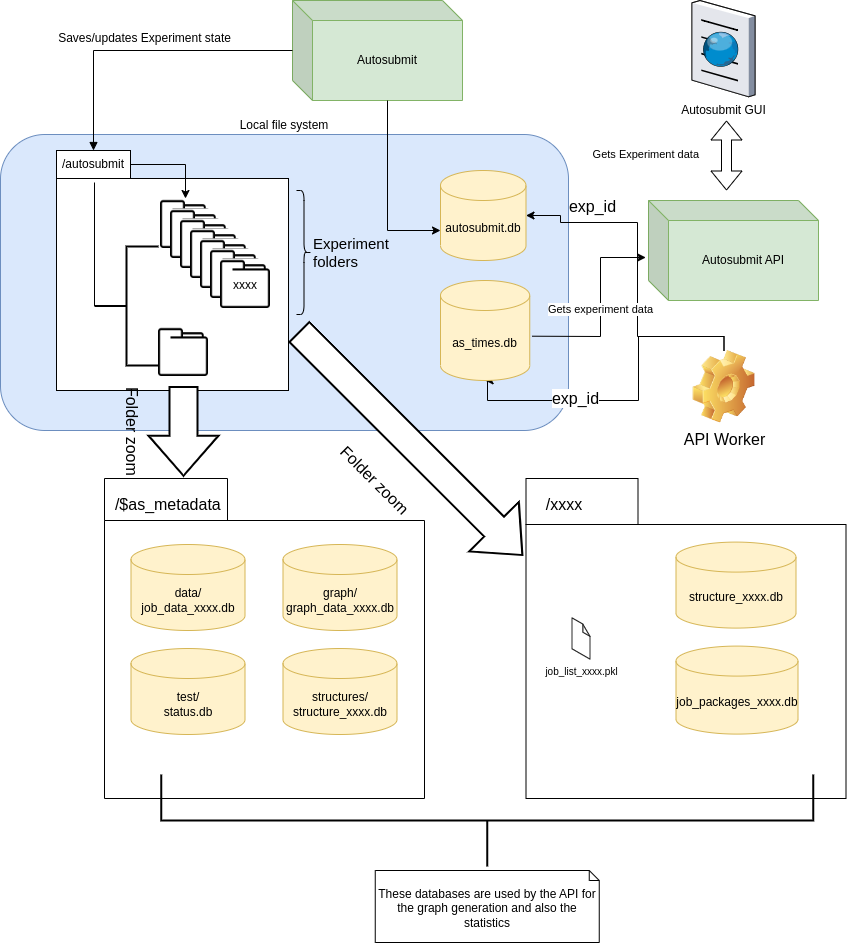

#########
Databases
#########

Introduction
------------

Autosubmit stores information about its experiments and workflows in databases
managed through SQLAlchemy. The default backend is SQLite, and PostgreSQL is also
supported. These databases are distributed through the local filesystem, where
Autosubmit is installed and runs.

There is one central database that supports the core functionality of
experiments in Autosubmit. There are other auxiliary databases consumed
by Autosubmit and the Autosubmit API, that store finer-grained experiment information.

The name and location of the central database are defined in the ``.autosubmitrc``
configuration file while the other auxiliary databases have a predefined name.
There are also log files with important information about experiment execution and
some other relevant information such as experiment job statuses, timestamps, error
messages among other things inside these files.

.. note::

  The ``<EXPID>`` is an experiment ID. The location of the databases of
  other files can be customized in the ``.autosubmitrc`` configuration file.

Core databases
---------------

.. list-table::
   :header-rows: 1

   * - Database
     - Default location
     - Description
   * - ``autosubmit.db``
     - ``$HOME/autosubmit/autosubmit.db``
     - The main database of Autosubmit. Stores the experiments (``experiment``),
       their details (``details``) and the per-target schema versions
       (``schema_migrations``). Its location can be customized in the
       ``autosubmitrc`` file.
   * - ``as_times.db``
     - ``$HOME/autosubmit/as_times.db``
     - Stores the experiment status (``experiment_status``, ``RUNNING`` or
       ``NOT RUNNING``). Autosubmit sets ``RUNNING`` when an experiment starts;
       the Autosubmit API updates the status of inactive experiments, so both
       processes write to this database.

Auxiliary databases
--------------------

These databases complement the databases previously described for different purposes.
Some of them are centralized in the ``$AS_METADATA`` directory (defined in the
``.autosubmitrc`` config file) while others are present inside each experiment folder.

Databases in the ``$AS_METADATA`` directory
^^^^^^^^^^^^^^^^^^^^^^^^^^^^^^^^^^^^^^^^^^^

.. list-table::
   :header-rows: 1

   * - Database
     - Default location
     - Description
   * - ``graph_data_<EXPID>.db``
     - ``$HOME/autosubmit/metadata/graph/graph_data_<EXPID>.db``
     - Used by the GUI to improve the graph visualization. Populated by an API worker.
   * - ``structure_<EXPID>.db``
     - ``$HOME/autosubmit/metadata/structures/structure_<EXPID>.db``
     - Used by the GUI to display edge lists. Populated by an API worker.
   * - ``job_data_<EXPID>.db``
     - ``$HOME/autosubmit/metadata/data/job_data_<EXPID>.db``
     - Stores experiment metrics and historical information. Populated by Autosubmit.

Databases in each experiment directory
^^^^^^^^^^^^^^^^^^^^^^^^^^^^^^^^^^^^^^

.. list-table::
   :header-rows: 1

   * - Database
     - Default location
     - Description
   * - ``job_list.db``
     - ``$HOME/autosubmit/<EXPID>/db/job_list.db``
     - Stores the experiment workflow (jobs, edges, sections and wrappers).
       Populated by Autosubmit; it replaces the old ``job_list_<EXPID>.pkl`` pickle.

Other files
-----------

Autosubmit stores update list files, used to change the status of experiment jobs
without stopping Autosubmit. These files are plain text files, and also present
in the experiment directory.
