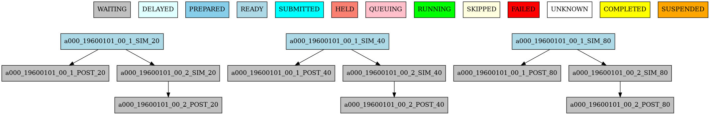
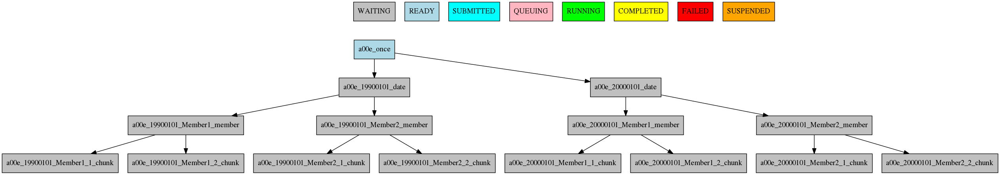
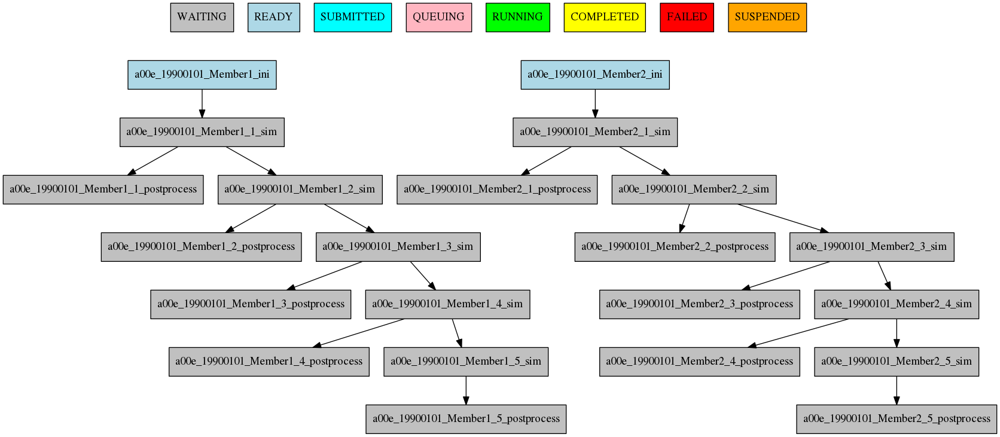
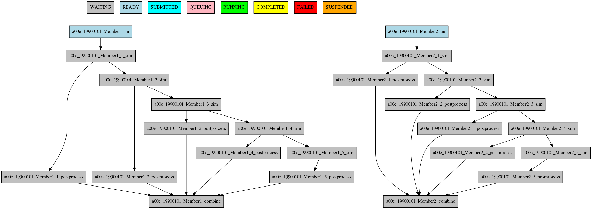

Defining the workflow
=====================

One of the most important step that you have to do when planning to use autosubmit for an experiment is the definition
of the workflow the experiment will use. In this section you will learn about the workflow definition syntax so you will
be able to exploit autosubmit's full potential

.. warning::
   This section is NOT intended to show how to define your jobs. Please go to :doc:`/qstartguide/index` section for a comprehensive
   list of job options.

Simple workflow
---------------

The simplest workflow that can be defined it is a sequence of two jobs, with the second one triggering at the end of
the first. To define it, we define the two jobs and then add a DEPENDENCIES attribute on the second job referring to the
first one.

It is important to remember when defining workflows that DEPENDENCIES on autosubmit always refer to jobs that should
be finished before launching the job that has the DEPENDENCIES attribute.

.. runcmd:: mv ./userguide/defining_workflows/code/simple_job.yml /home/docs/autosubmit/a000/conf/jobs_a000.yml
    :silent-output: 1
    :prompt:

.. runcmd:: autosubmit monitor a000 --hide -o png
    :silent-output: 1
    :prompt:

.. code-block:: yaml

  JOBS:
    ONE:
      FILE: one.sh

    TWO:
      FILE: two.sh
      DEPENDENCIES: One

.. runcmd:: find /home/docs/autosubmit/a000/plot/ -type f -iname "a000_*.png" -exec mv -- {} ./userguide/defining_workflows/fig/simple.png \;
    :silent-output: 1
    :prompt:

The resulting workflow can be seen in Figure :numref:`simple`

   Example showing a simple workflow with two sequential jobs

Running jobs once per startdate, member or chunk
------------------------------------------------

Autosubmit is capable of running ensembles made of various startdates and members. It also has the capability to
divide member execution on different chunks.

To set at what level a job has to run you have to use the RUNNING attribute. It has four possible values: once, date,
member and chunk corresponding to running once, once per startdate, once per member or once per chunk respectively.

.. runcmd:: mv ./userguide/defining_workflows/code/job_startdate.yml /home/docs/autosubmit/a001/conf/jobs_a001.yml
    :silent-output: 1
    :prompt:

.. runcmd:: mv -v ./userguide/defining_workflows/code/exp_startdate.yml /home/docs/autosubmit/a001/conf/expdef_a001.yml
    :silent-output: 1
    :prompt:

.. code-block:: yaml

    EXPERIMENT:
      DATELIST: 19900101 20000101
      MEMBERS: Member1 Member2
      CHUNKSIZEUNIT: month
      CHUNKSIZE: '4'
      NUMCHUNKS: '2'
      CHUNKINI: ''
      CALENDAR: standard
      
    JOBS:
      ONCE:
          FILE: once.sh

      DATE:
          FILE: date.sh
          DEPENDENCIES: once
          RUNNING: date

      MEMBER:
          FILE: member.sh
          DEPENDENCIES: date
          RUNNING: member

      CHUNCK:
          FILE: chunk.sh
          DEPENDENCIES: member
          RUNNING: chunk

.. runcmd:: autosubmit monitor a001 --hide -o png
    :silent-output: 1
    :prompt:

.. runcmd:: find /home/docs/autosubmit/a001/plot/ -type f -iname "a001_*.png" -exec mv -- {} ./userguide/defining_workflows/fig/running.png \;
    :silent-output: 1
    :prompt:

The resulting workflow can be seen in Figure :numref:`running` for a experiment with 2 startdates, 2 members and 2 chunks.

   Example showing how to run jobs once per startdate, member or chunk.

Dependencies
------------

Dependencies on autosubmit were introduced on the first example, but in this section you will learn about some special
cases that will be very useful on your workflows.

Dependencies with previous jobs
~~~~~~~~~~~~~~~~~~~~~~~~~~~~~~~

Autosubmit can manage dependencies between jobs that are part of different chunks, members or startdates. The next
example will show how to make a simulation job wait for the previous chunk of the simulation. To do that, we add
sim-1 on the DEPENDENCIES attribute. As you can see, you can add as much dependencies as you like separated by spaces

.. runcmd:: mv ./userguide/defining_workflows/code/job_dependecy_previous.yml /home/docs/autosubmit/a002/conf/jobs_a002.yml
    :silent-output: 1
    :prompt:

.. runcmd:: mv ./userguide/defining_workflows/code/exp_dependecy_previous.yml /home/docs/autosubmit/a002/conf/expdef_a002.yml
    :silent-output: 1
    :prompt:

.. code-block:: yaml

    EXPERIMENT:
      DATELIST: 19900101
      MEMBERS: Member1 Member2
      CHUNKSIZEUNIT: month
      CHUNKSIZE: 1
      NUMCHUNKS: 5
      CHUNKINI: ''
      CALENDAR: standard

   JOBS:
    INI:
      FILE: ini.sh
      RUNNING: member

    SIM:
      FILE: sim.sh
      DEPENDENCIES: ini sim-1
      RUNNING: chunk

    POSTPROCESS:
      FILE: postprocess.sh
      DEPENDENCIES: sim
      RUNNING: chunk

.. runcmd:: autosubmit create a002 --hide -o png
    :silent-output: 1
    :prompt:

.. runcmd:: find /home/docs/autosubmit/a002/plot/ -type f -iname "a002_*.png" -exec mv -- {} ./userguide/defining_workflows/fig/dependencies_previous.png \;
    :silent-output: 1
    :prompt:

The resulting workflow can be seen in Figure :numref:`dprevious`

.. warning::

   Autosubmit simplifies the dependencies, so the final graph usually does not show all the lines that you may expect to
   see. In this example you can see that there are no lines between the ini and the sim jobs for chunks 2 to 5 because
   that dependency is redundant with the one on the previous sim

   Example showing dependencies between sim jobs on different chunks.

Dependencies between running levels
~~~~~~~~~~~~~~~~~~~~~~~~~~~~~~~~~~~

On the previous examples we have seen that when a job depends on a job on a higher level (a running chunk job depending
on a member running job) all jobs wait for the higher running level job to be finished. That is the case on the ini sim dependency
on the next example.

In the other case, a job depending on a lower running level job, the higher level job will wait for ALL the lower level
jobs to be finished. That is the case of the postprocess combine dependency on the next example.

.. runcmd:: mv ./userguide/defining_workflows/code/job_dependencies_running.yml /home/docs/autosubmit/a002/conf/jobs_a002.yml
    :silent-output: 1
    :prompt:

.. runcmd:: autosubmit monitor a002 --hide -o png
    :silent-output: 1
    :prompt:

.. code-block:: yaml

    JOBS:
      INI:
        FILE: ini.sh
        RUNNING: member

      SIM:
        FILE: sim.sh
        DEPENDENCIES: ini sim-1
        RUNNING: chunk

      POSTPROCESS:
        FILE: postprocess.sh
        DEPENDENCIES: sim
        RUNNING: chunk

      COMBINE:
        FILE: combine.sh
        DEPENDENCIES: postprocess
        RUNNING: member

.. runcmd:: find /home/docs/autosubmit/a002/plot/ -type f -iname "a002_*.png" -exec mv -vf -- {} ./userguide/defining_workflows/fig/dependencies_running.png \;
    :silent-output: 1
    :prompt:

The resulting workflow can be seen in Figure :numref:`dependencies`

   Example showing dependencies between jobs running at different levels.

Dependencies rework
~~~~~~~~~~~~~~~~~~~

The DEPENDENCIES key is used to define the dependencies of a job. It can be used in the following ways:

* Basic: The dependencies are a list of jobs, separated by " ", that runs before the current task is submitted.
* New: The dependencies is a list of YAML sections, separated by "\n", that runs before the current job is submitted.

  * For each dependency section, you can designate the following keywords to control the current job-affected tasks:

    * DATES_FROM: Selects the job dates that you want to alter.
    * MEMBERS_FROM: Selects the job members that you want to alter.
    * CHUNKS_FROM: Selects the job chunks that you want to alter.

  * For each dependency section and \*_FROM keyword, you can designate the following keywords to control the destination of the dependency:

    * DATES_TO: Links current selected tasks to the dependency tasks of the dates specified.
    * MEMBERS_TO: Links current selected tasks to the dependency tasks of the members specified.
    * CHUNKS_TO: Links current selected tasks to the dependency tasks of the chunks specified.

  * Important keywords for [DATES|MEMBERS|CHUNKS]_TO:

    * "natural": Will keep the default linkage. Will link if it would be normally. Example, SIM_FC00_CHUNK_1 -> DA_FC00_CHUNK_1.
    * "all": Will link all selected tasks of the dependency with current selected tasks. Example, SIM_FC00_CHUNK_1 -> DA_FC00_CHUNK_1, DA_FC00_CHUNK_2, DA_FC00_CHUNK_3...
    * "none": Will unlink selected tasks of the dependency with current selected tasks.

For the new format, consider that the priority is hierarchy and goes like this DATES_FROM -(includes)-> MEMBERS_FROM -(includes)-> CHUNKS_FROM.

* You can define a DATES_FROM inside the DEPENDENCY.
* You can define a MEMBERS_FROM inside the DEPENDENCY and DEPENDENCY.DATES_FROM.
* You can define a CHUNKS_FROM inside the DEPENDENCY, DEPENDENCY.DATES_FROM, DEPENDENCY.MEMBERS_FROM, DEPENDENCY.DATES_FROM.MEMBERS_FROM

Start conditions
~~~~~~~~~~~~~~~~

Sometimes you want to run a job only when a certain condition is met. For example, you may want to run a job only when a certain task is running.
This can be achieved using the START_CONDITIONS feature based on the dependencies rework.

Start conditions are achieved by adding the keyword ``STATUS`` and optionally ``FROM_STEP`` keywords into any dependency that you want.

The ``STATUS`` keyword can be used to select the status of the dependency that you want to check. The possible values ( case-insensitive ) are:

.. list-table::
    :widths: 25 75
    :header-rows: 1

    * - Values
      - Description
    * - ``WAITING``
      - The task is waiting for its dependencies to be completed.
    * - ``DELAYED``
      - The task is delayed by a delay condition.
    * - ``PREPARED``
      - The task is prepared to be submitted.
    * - ``READY``
      - The task is ready to be submitted.
    * - ``SUBMITTED``
      - The task is submitted.
    * - ``HELD``
      - The task is held.
    * - ``QUEUING``
      - The task is queuing.
    * - ``RUNNING``
      - The task is running.
    * - ``SKIPPED``
      - The task is skipped.
    * - ``FAILED``
      - The task is failed.
    * - ``UNKNOWN``
      - The task is unknown.
    * - ``COMPLETED``
      - The task is completed. # Default
    * - ``SUSPENDED``
      - The task is suspended.

The status are ordered, so if you select ``RUNNING`` status, the task will be run if the parent is in any of the following statuses: ``RUNNING``, ``QUEUING``, ``HELD``, ``SUBMITTED``, ``READY``, ``PREPARED``, ``DELAYED``, ``WAITING``.

.. code-block:: yaml

    JOBS:
      INI:
          FILE: ini.sh
          RUNNING: member

      SIM:
          FILE: sim.sh
          DEPENDENCIES: ini sim-1
          RUNNING: chunk

      POSTPROCESS:
          FILE: postprocess.sh
          DEPENDENCIES:
              SIM:
                  STATUS: "RUNNING"
          RUNNING: chunk

The ``FROM_STEP`` keyword can be used to select the **internal** step of the dependency that you want to check. The possible value is an integer. Additionally, the target dependency, must call to `%AS_CHECKPOINT%` inside their scripts. This will create a checkpoint that will be used to check the amount of steps processed.

.. code-block:: yaml

  JOBS:
    A:
      FILE: a.sh
      RUNNING: once
      SPLITS: 2
    A_2:
      FILE: a_2.sh
      RUNNING: once
      DEPENDENCIES:
        A:
          SPLIT_TO: "2"
          STATUS: "RUNNING"
          FROM_STEP: 2

There is now a new function that is automatically added in your scripts which is called ``as_checkpoint``. This is the function that is generating the checkpoint file. You can see the function below:

.. code-block:: bash

    ###################
    # AS CHECKPOINT FUNCTION
    ###################
    # Creates a new checkpoint file upon call based on the current numbers of calls to the function

    AS_CHECKPOINT_CALLS=0
    function as_checkpoint {
        AS_CHECKPOINT_CALLS=$((AS_CHECKPOINT_CALLS+1))
        touch ${job_name_ptrn}_CHECKPOINT_${AS_CHECKPOINT_CALLS}
    }

And what you would have to include in your target dependency or dependencies is the call to this function which in this example is a.sh.

The amount of calls is strongly related to the ``FROM_STEP`` value.

``$expid/proj/$projname/as.sh``

.. code-block:: bash

  ##compute somestuff
  as_checkpoint
  ## compute some more stuff
  as_checkpoint

To select an specific task, you have to combine the ``STATUS`` and ``CHUNKS_TO`` , ``MEMBERS_TO`` and ``DATES_TO``, ``SPLITS_TO`` keywords.

.. code-block:: yaml

  JOBS:
    A:
      FILE: a
      RUNNING: once
      SPLITS: 1
    B:
      FILE: b
      RUNNING: once
      SPLITS: 2
      DEPENDENCIES: A
    C:
      FILE: c
      RUNNING: once
      SPLITS: 1
      DEPENDENCIES: B
    RECOVER_B_2:
      FILE: fix_b
      RUNNING: once
      DEPENDENCIES:
        B:
          SPLIT_TO: "2"
          STATUS: "RUNNING"
