Monitor and Check Experiments
=============================

How to check the experiment configuration
-----------------------------------------

To check the configuration of the experiment, use the command:
::

    autosubmit check EXPID

*EXPID* is the experiment identifier.

It checks experiment configuration and warns about any detected error or inconsistency.
It is used to check if the script is well-formed.
If any template has an inconsistency it will replace them for an empty value on the cmd generated.
Options:

.. runcmd:: autosubmit check -h


Example:
::

    autosubmit check <EXPID>

How to use check in running time:
~~~~~~~~~~~~~~~~~~~~~~~~~~~~~~~~~

In ``jobs_<EXPID>.yml``, you can set check (default true) to check the scripts during autosubmit run.

There are two parameters related to check:

* CHECK: Controls the mechanism that allows replacing an unused variable with an empty string ( %_% substitution). It is TRUE by default.

* SHOW_CHECK_WARNINGS: For debugging purposes. It will print a lot of information regarding variables and substitution if it is set to TRUE.

.. code-block:: yaml

    CHECK: TRUE or FALSE or ON_SUBMISSION # Default is TRUE
    SHOW_CHECK_WARNINGS: TRUE or FALSE # Default is FALSE


::

    CHECK: TRUE # Static templates (existing on `autosubmit create`). Used to substitute empty variables

    CHECK: ON_SUBMISSION # Dynamic templates (generated on running time). Used to substitute empty variables.

    CHECK: FALSE # Used to disable this substitution.

::

    SHOW_CHECK_WARNINGS: TRUE # Shows a LOT of information. Disabled by default.


For example:

.. code-block:: yaml

    LOCAL_SETUP:
        FILE: filepath_that_exists
        PLATFORM: LOCAL
        WALLCLOCK: 05:00
        CHECK: TRUE
        SHOW_CHECK_WARNINGS: TRUE
        ...
    SIM:
        FILE: filepath_that_no_exists_until_setup_is_processed
        PLATFORM: bsc_es
        DEPENDENCIES: LOCAL_SETUP SIM-1
        RUNNING: chunk
        WALLCLOCK: 05:00
        CHECK: ON_SUBMISSION
        SHOW_CHECK_WARNINGS: FALSE
        ...

.. _inspect_cmd:

How to generate cmd files
-------------------------

The `inspect` command generates the ``.cmd`` files for jobs in an experiment without
submitting them. This allows you to preview the rendered scripts and verify that all
parameters are correctly substituted prior to submission.

To generate the cmd files of the current **non-active** jobs experiment, use the command:
::

    autosubmit inspect EXPID

EXPID is the experiment identifier.

Options:

.. runcmd:: autosubmit inspect -h

Examples:

with autosubmit.lock present or not:
::

    autosubmit inspect <EXPID>

with autosubmit.lock present or not:
::

    autosubmit inspect <EXPID> -f

without autosubmit.lock:
::

    autosubmit inspect <EXPID> -fl [-fc,-fs or -ft]

To generate cmd for wrappers:
::

    autosubmit inspect <EXPID> -cw -f


With autosubmit.lock and no (-f) force, it will only generate all files that are not submitted.

Without autosubmit.lock, it will generate all unless filtered by -fl,-fc,-fs or -ft.

The following filters can be combined to select jobs to inspect.

+--------+----------------------------------------------+----------------------------------------------+
| FILTER | Meaning                                      | Example of VALUE_TO_FILTER                   |
+========+==============================================+==============================================+
| -fl    | filter by job name                           | ``-fl "a000_20101101_fc3_21_SIM"``         |
+--------+----------------------------------------------+----------------------------------------------+
| -fs    | filter by job status                         | ``-fs FAILED``                               |
+--------+----------------------------------------------+----------------------------------------------+
| -ft    | filter by job type  (and optionally split)   | ``-ft TRANSFER``                             |
+--------+----------------------------------------------+----------------------------------------------+
| -fc    | filter by chunk/section/split                | ``-fc "[ 19601101 [ fc1 [1] ] ]"``         |
+--------+----------------------------------------------+----------------------------------------------+

If multiple filters are provided (``-fl, -fs, -ft, -fc``), they will be combined as logical AND, meaning that only jobs matching ALL specified filters will be selected for inspection.

To combine multiple filters:
::

    autosubmit inspect <EXPID> \
        -fc "[20200101 [ fc0 [1] ] ]" \
        -fs WAITING \
        -ft LOCALJOB \
        -fl "<EXPID>_20200101_fc0_1_1_LOCALJOB"

        
To generate cmd only for one job per section:
::

    autosubmit inspect <EXPID> -q


How to monitor an experiment
----------------------------

The `monitor` command allows you to visualize the experiment workflow and shows each job's status (color coded)
or stores a text file with the status of each job. You can select which jobs to monitor by using optional filters
and grouping options.

To monitor the status of the experiment, use the command:
::

    autosubmit monitor EXPID

*EXPID* is the experiment identifier.

Options:

.. runcmd:: autosubmit monitor -h


Example:
::

    autosubmit monitor <EXPID>

The location where the user can find the generated plots with date and timestamp can be found below:

::

    <experiments_directory>/<EXPID>/plot/<EXPID>_<DATE>_<TIME>.pdf

The location where the user can find the txt output containing the status of each job and the path to out and err log files.

::

    <experiments_directory>/<EXPID>/status/<EXPID>_<DATE>_<TIME>.txt


The following filters can be combined to select jobs to monitor.

+--------+----------------------------------------------+----------------------------------------------+
| FILTER | Meaning                                      | Example of VALUE_TO_FILTER                   |
+========+==============================================+==============================================+
| -fl    | filter by job name                           | ``-fl "a000_20101101_fc3_21_SIM"``           |
+--------+----------------------------------------------+----------------------------------------------+
| -fs    | filter by job status                         | ``-fs FAILED``                               |
+--------+----------------------------------------------+----------------------------------------------+
| -ft    | filter by job type  (and optionally split)   | ``-ft TRANSFER``                             |
+--------+----------------------------------------------+----------------------------------------------+
| -fc    | filter by chunk/section/split                | ``-fc "[ 19601101 [ fc1 [1] ] ]"``           |
+--------+----------------------------------------------+----------------------------------------------+

If multiple filters are provided (``-fl, -fs, -ft, -fc``), they will be combined as logical AND, meaning that only jobs matching ALL specified filters will be selected for monitoring.

Example of combined filters:

::

        autosubmit monitor <EXPID> \
            -fc "[20200101 [ fc0 [1] ] ]" \
            -fs WAITING \
            -ft LOCALJOB \
            -fl "<EXPID>_20200101_fc0_1_1_LOCALJOB"

.. _job_status_reference:

Possible job status
~~~~~~~~~~~~~~~~~~~

Autosubmit jobs can move through the following statuses.

* ``WAITING`` - The job is waiting for dependencies to reach the required conditions.
* ``DELAYED`` - The job is temporarily postponed and will be reconsidered later.
* ``PREPARED`` - The job is prepared for submission.
* ``READY`` - The job is eligible to be submitted.
* ``SUBMITTED`` - The job has been submitted to the platform.
* ``HELD`` - The job is held in the queue, for example by scheduler policy or manual hold.
* ``QUEUING`` - The job is queued in the scheduler and waiting for resources.
* ``RUNNING`` - The job is currently executing.
* ``SKIPPED`` - The job execution was intentionally skipped.
* ``FAILED`` - The job execution finished with an error.
* ``UNKNOWN`` - Autosubmit could not determine the current job state from the platform.
* ``COMPLETED`` - The job finished successfully.
* ``SUSPENDED`` - The running or queued job was suspended.

.. hint::
    Very large plots may be a problem for some pdf and image viewers.
    If you are having trouble with your usual monitoring tool, try using svg output and opening it with Google Chrome with the SVG Navigator extension installed.

In order to understand more the grouping options, please check :ref:`grouping`.

.. _grouping:

Grouping jobs
-------------

Other than the filters, another option for large workflows is to group jobs. This option is available with the ``group_by`` keyword, which can receive the values ``{date,member,chunk,split,automatic}``.

For the first 4 options, the grouping criteria is explicitly defined ``{date,member,chunk,split}``.
In addition to that, it is possible to expand some dates/members/chunks that would be grouped either/both by status or/and by specifying the date/member/chunk not to group.
The syntax used in this option is almost the same as for the filters, in the format of ``[ date1 [ member1 [ chunk1 chunk2 ] member2 [ chunk3 ... ] ... ] date2 [ member3 [ chunk1 ] ] ... ]``

.. important:: The grouping option is also in autosubmit monitor, create, setstatus and recovery

Examples:

Consider the following workflow:

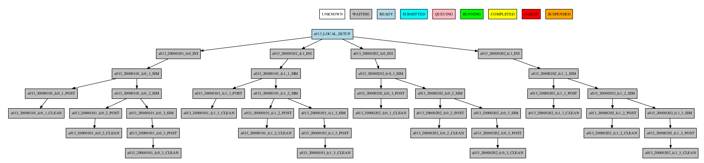

**Group by date**

::

    -group_by=date

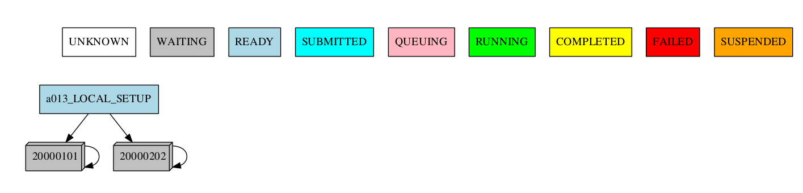

::

    -group_by=date -expand="[ 20000101 ]"

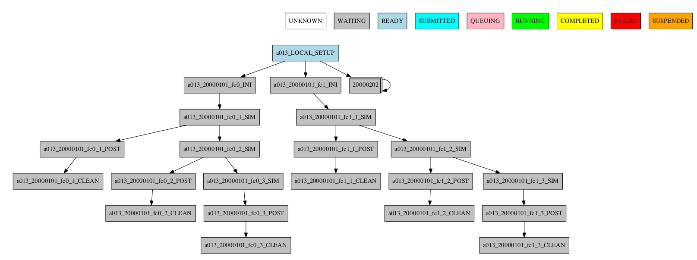


::

    -group_by=date -expand_status="FAILED RUNNING"

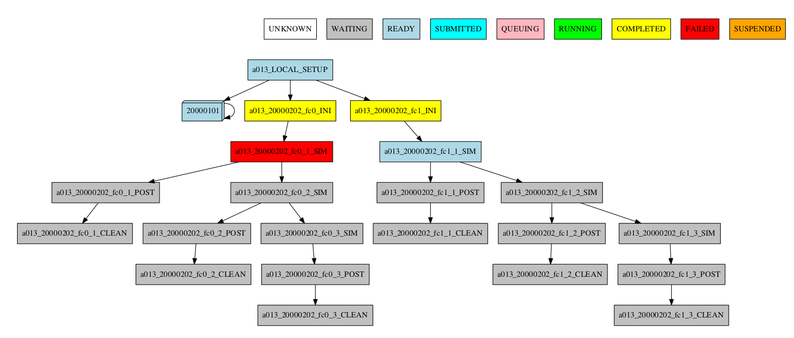

::

    -group_by=date -expand="[ 20000101 ]" -expand_status="FAILED RUNNING"

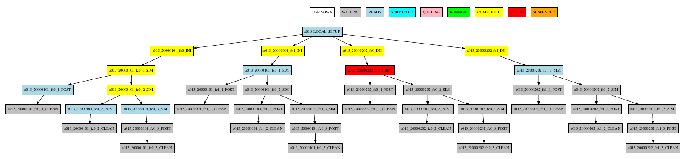

**Group by member**

::

    -group_by=member

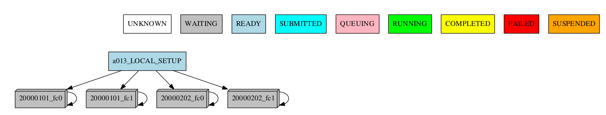


::

    -group_by=member -expand="[ 20000101 [ fc0 fc1 ] 20000202 [ fc0 ] ]"

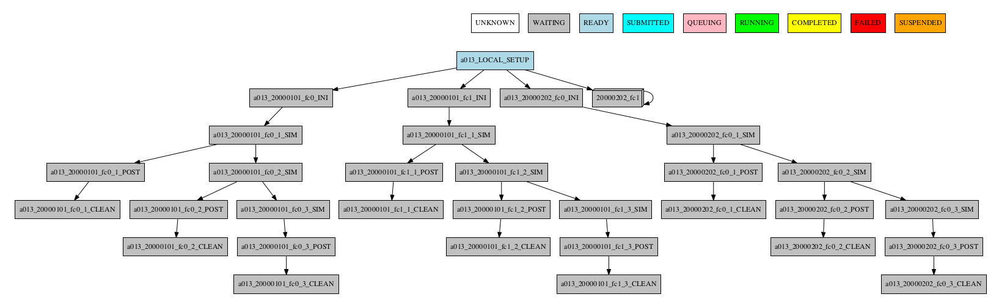

::

    -group_by=member -expand_status="FAILED QUEUING"

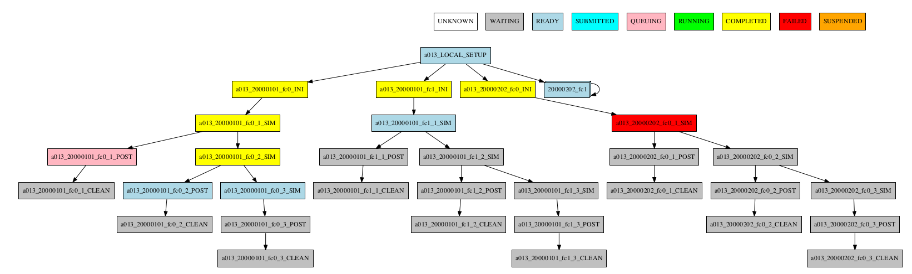

::

    -group_by=member -expand="[ 20000101 [ fc0 fc1 ] 20000202 [ fc0 ] ]" -expand_status="FAILED QUEUING"

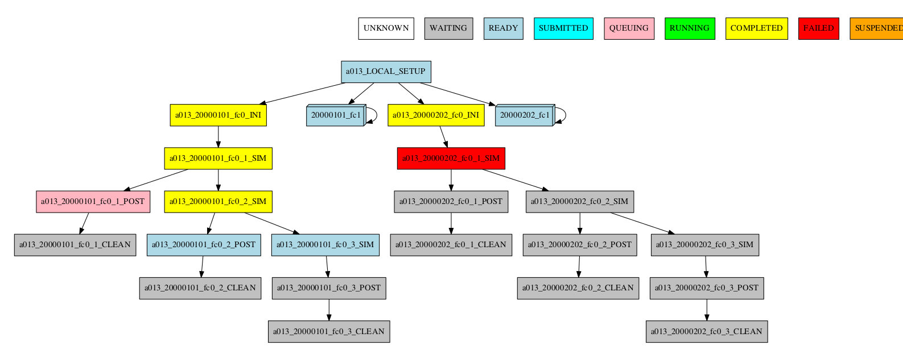

**Group by chunk**

::

    -group_by=chunk

TODO: Add ``group_chunk.png`` figure.

..
  figure:: fig/group_chunk.png
  :name: group_chunk
  :width: 70%
  :align: center
  :alt: group chunk

Synchronize jobs

If jobs are synchronized between members or dates, then a connection between groups is shown:

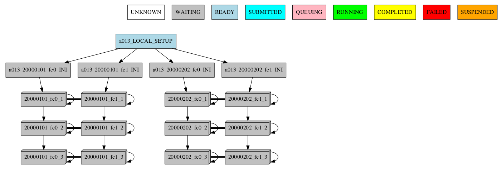

::

    -group_by=chunk -expand="[ 20000101 [ fc0 [1 2] ] 20000202 [ fc1 [2] ] ]"

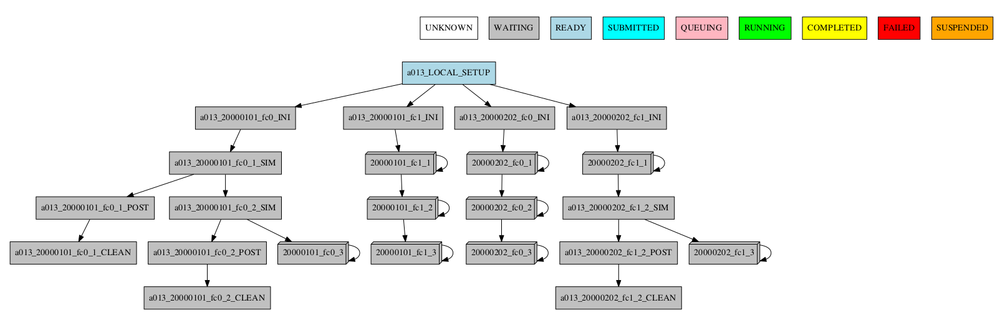

::

    -group_by=chunk -expand_status="FAILED RUNNING"

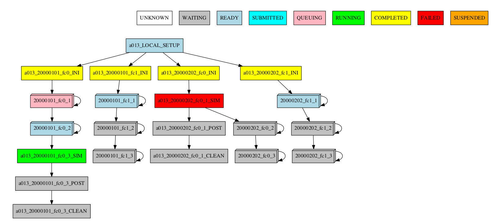

::

    -group_by=chunk -expand="[ 20000101 [ fc0 [1] ] 20000202 [ fc1 [1 2] ] ]" -expand_status="FAILED RUNNING"

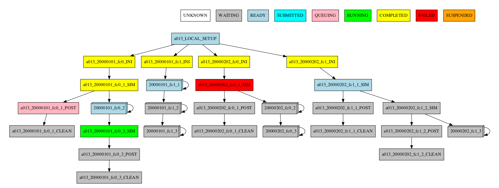

**Group by split**

If there are chunk jobs that are split, the splits can also be grouped.

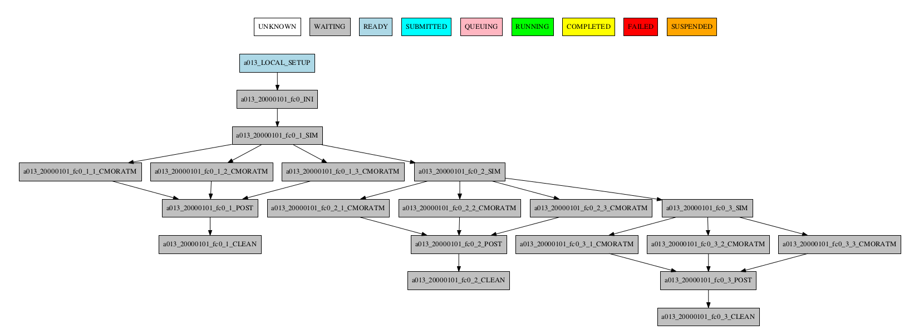

::

    -group_by=split

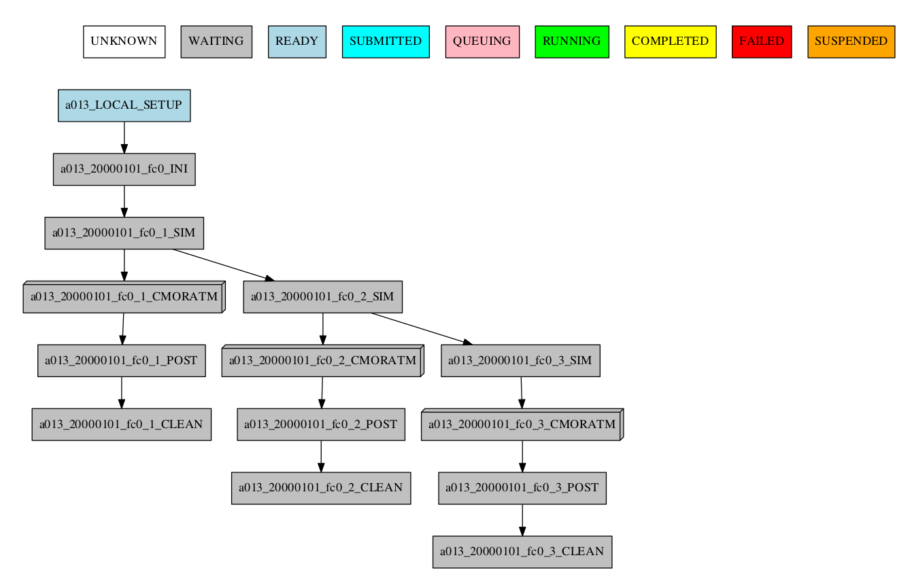

**Understanding the group status**

If there are jobs with different status grouped together, the status of the group is determined as follows:
If there is at least one job that failed, the status of the group will be FAILED. If there are no failures but there is at least one job running, the status will be RUNNING.
The same idea applies following the hierarchy: SUBMITTED, QUEUING, READY, WAITING, SUSPENDED, UNKNOWN. If the group status is COMPLETED, it means that all jobs in the group were completed.

**Automatic grouping**

For the automatic grouping, the groups are created by collapsing the split->chunk->member->date that share the same status (following this hierarchy).
The following workflow automatic created the groups 20000101_fc0, since all the jobs for this date and member were completed, 20000101_fc1_3, 20000202_fc0_2, 20000202_fc0_3 and 20000202_fc1, as all the jobs up to the respective group granularity share the same - waiting - status.

For example:

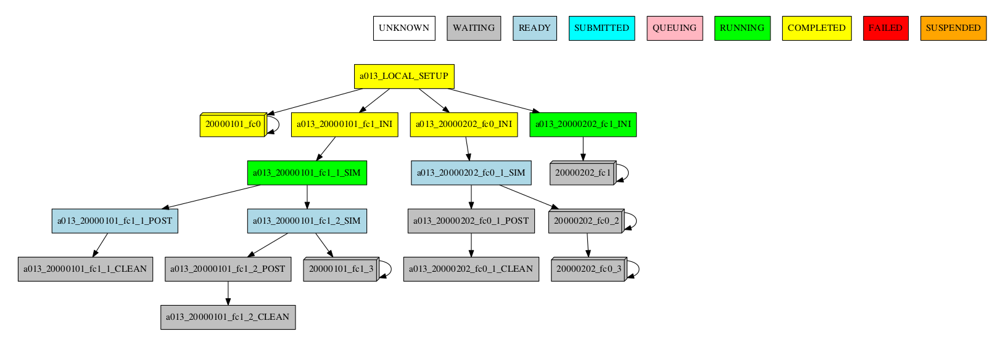

Especially in the case of monitoring an experiment with a very large number of chunks, it might be useful to hide the groups created automatically. This allows to better visualize the chunks in which there are jobs with different status, which can be a good indication that there is something currently happening within such chunks (jobs ready, submitted, running, queueing or failed).

::

    -group_by=automatic --hide_groups

.. _monitor_profiling:

How to profile Autosubmit while monitoring an experiment
--------------------------------------------------------

Autosubmit offers the possibility to profile the execution of the monitoring process. To enable the
profiler, just add the ``--profile`` (or ``-p``) flag to your ``autosubmit monitor`` command, as in
the following example:

.. code-block:: bash

    autosubmit monitor --profile EXPID

.. include:: ../../_include/profiler_common.rst

How to get details about the experiment
---------------------------------------

To get details about the experiment, use the command:
::

    autosubmit describe [EXPID] [-u USERNAME]


*EXPID* is the experiment identifier, can be a list of expid separated by comma or spaces
*-u USERNAME* is the username of the user who submitted the experiment.

It displays information about the experiment. Currently it describes owner,description_date,model,branch and hpc

Options:

.. runcmd:: autosubmit describe -h


Examples:
::

   autosubmit describe <EXPID>
   autosubmit describe "<EXPID> <EXPID>"
   autosubmit describe <EXPID>,<EXPID>
   autosubmit describe -u dbeltran

.. _autoStatistics:

How to monitor job statistics
-----------------------------

The following command could be adopted to generate the plots for visualizing the jobs statistics of the experiment at any instance:
::

    autosubmit stats EXPID

*EXPID* is the experiment identifier.

Options:

.. runcmd:: autosubmit stats -h


Example:
::

    autosubmit stats <EXPID>

The location where user can find the generated plots with date and timestamp can be found below:

::

    <experiments_directory>/<EXPID>/plot/<EXPID>_statistics_<DATE>_<TIME>.pdf

For including the summaries:
::

        autosubmit stats --section_summary --jobs_summary <EXPID>

The location will be:
::

        <experiments_directory>/<EXPID>/stats/<EXPID>_section_summary_<DATE>_<TIME>.pdf
        <experiments_directory>/<EXPID>/stats/<EXPID>_jobs_summary_<DATE>_<TIME>.pdf

Console output description
~~~~~~~~~~~~~~~~~~~~~~~~~~

Example:
::

    Period: 2021-04-25 06:43:00 ~ 2021-05-07 18:43:00
    Submitted (#): 37
    Run  (#): 37
    Failed  (#): 3
    Completed (#): 34
    Queueing time (h): 1.61
    Expected consumption real (h): 2.75
    Expected consumption CPU time (h): 3.33
    Consumption real (h): 0.05
    Consumption CPU time (h): 0.06
    Consumption (%): 1.75

Where:

- Period: Requested time frame.
- Submitted: Total number of attempts that reached the SUBMITTED status.
- Run: Total number of attempts that reached the RUNNING status.
- Failed: Total number of FAILED attempts of running a job.
- Completed: Total number of attempts that reached the COMPLETED status.
- Queueing time (h): Sum of the time spent queuing by attempts that reached the COMPLETED status, in hours.
- Expected consumption real (h): Sum of wallclock values for all jobs, in hours.
- Expected consumption CPU time (h): Sum of the products of wallclock value and number of requested processors for each job, in hours.
- Consumption real (h): Sum of the time spent running by all attempts of jobs, in hours.
- Consumption CPU time (h): Sum of the products of the time spent running and number of requested processors for each job, in hours.
- Consumption (%): Percentage of `Consumption CPU time` relative to `Expected consumption CPU time`.

Diagram output description
~~~~~~~~~~~~~~~~~~~~~~~~~~

The main `stats` output is a bar diagram. On this diagram, each job presents these values:

- Queued (h): Sum of time spent queuing for COMPLETED attempts, in hours.
- Run (h): Sum of time spent running for COMPLETED attempts, in hours.
- Failed jobs (#): Total number of FAILED attempts.
- Fail Queued (h): Sum of time spent queuing for FAILED attempts, in hours.
- Fail Run (h): Sum of time spent running for FAILED attempts, in hours.
- Max wallclock (h): Maximum wallclock value for all jobs in the plot.

Notice that the left scale of the diagram measures the time in hours, and the right scale measures the number of attempts.

Summaries output description
~~~~~~~~~~~~~~~~~~~~~~~~~~~~
**Section summary**

For each section, the following values are displayed:

- Count: Number of completed or running jobs.
- Queue Sum (h): Sum of time spent queuing for completed or running jobs, in hours.
- Avg Queue (h): Average time spent queuing for completed or running jobs, in hours.
- Run Sum (h): Sum of time spent running for completed or running jobs, in hours.
- Avg Run (h): Average time spent running for completed or running jobs, in hours.

CSV files are also generated with the same information, in the same directory as the PDFs.

**Jobs summary**

For each job completed or running, the following values are displayed:

- Queue Time (h): Time spent queuing for the job, in hours.
- Run Time (h): Time spent running for the job, in hours.
- Status: Status of the job.

CSV files are also generated with the same information, in the same directory as the PDFs.

Custom statistics
~~~~~~~~~~~~~~~~~

Although Autosubmit saves several statistics about your experiment, such as the queueing time for each job, how many failures per job, etc.,
The user also might be interested in adding his particular statistics to the Autosubmit stats report (```autosubmit stats EXPID```).
The allowed format for this feature is the same as the Autosubmit configuration files: INI style. For example:
::

    COUPLING:
    LOAD_BALANCE: 0.44
    RECOMMENDED_PROCS_MODEL_A: 522
    RECOMMENDED_PROCS_MODEL_B: 418

The location where user can put this stats is in the file:
::

    <experiments_directory>/<EXPID>/tmp/<EXPID>_GENERAL_STATS

.. hint:: If it is not yet created, you can manually create the file: ``expid_GENERAL_STATS`` inside the ``tmp`` folder.

.. _report:

How to extract information about the experiment parameters
------------------------------------------------------------

The ``autosubmit report`` command extracts the parameters and resolved values
of an experiment. It has two modes, each generating their own file, and they can be used together:

* ``-all`` dumps every parameter Autosubmit knows about into a flat
  ``<expid>_parameter_list_<timestamp>.txt`` file. Useful for discovery and
  debugging.
* ``-t <template>`` renders a user-supplied template, substituting
  ``%KEY%`` markers with the corresponding values, into
  ``<expid>_report_<timestamp>.<ext>``. The output preserves the template's
  extension (``.md``, ``.html``, ``.rst``, …); files without an extension
  default to ``.txt``.

Both files land in the experiment's ``tmp/`` folder by default. Use ``-fp``
to write them elsewhere.

The command can be called with:

::

    autosubmit report EXPID -t "absolute_file_path"

Alternatively it also can be called as follows:

::

    autosubmit report EXPID -all

Options:

.. runcmd:: autosubmit report -h

What goes into the parameter list
~~~~~~~~~~~~~~~~~~~~~~~~~~~~~~~~~~~

The flat ``-all`` output contains, in order:

* **Global configuration** — paths, ``HPCARCH``, the full ``PLATFORMS.*``
  block, and the top-level YAML blocks (``EXPERIMENT.*``, ``PROJECT.*``,
  ``CONFIG.*``, ``GIT.*``, ``SVN.*``, ``RERUN.*``, ``STORAGE.*``,
  ``MAIL.*``, ``DEFAULT.*``).
* **Per-section job configuration** — for each job section defined in
  ``jobs_<expid>.yml``, the static YAML keys (``FILE``, ``PLATFORM``,
  ``RUNNING``, ``WALLCLOCK``, ``ADDITIONAL_FILES``) plus the runtime-resolved
  values (``CURRENT_HOST``, ``CURRENT_SCRATCH_DIR``, ``JOBNAME``, ``CHUNK``,
  ``PROCESSORS``, chunk dates, …).
* **Performance metrics** appended at the end, when the Autosubmit API is
  reachable.

For the full catalogue of variables, see the
:doc:`Variables reference <../variables>`.

Template syntax
~~~~~~~~~~~~~~~~~

Autosubmit parameters are encapsulated by ``%KEY%``, where ``KEY`` is any
parameter name from the ``-all`` output. Keys are case-insensitive, so
``%HPCARCH%``, ``%hpcarch%``, and ``%HpcArch%`` all substitute to the same
value.

Dotted keys reference nested values directly: ``%EXPERIMENT.DATELIST%``,
``%PLATFORMS.MARENOSTRUM5.HOST%``, ``%JOBS.SIM.WALLCLOCK%``.

To keep a literal ``%KEY%`` in the output (no substitution), wrap it as
``%%KEY%%``. For example, ``%%PLATFORMS.MARENOSTRUM5.HOST%%`` in the template
renders as the literal text ``%PLATFORMS.MARENOSTRUM5.HOST%`` in the output.

Unknown placeholders render as ``-`` by default. Pass ``--placeholders`` to
leave them in the output verbatim — useful while iterating on a template,
since unmatched keys remain greppable. Autosubmit also logs a warning
listing the first unmatched keys it encountered.

Once you know how a parameter is called, you can create a template similar to
the one as follows:

.. code-block:: ini
   :caption: Template format and example.

    === CONFIG ===
    CONFIG.AUTOSUBMIT_VERSION : %CONFIG.AUTOSUBMIT_VERSION%
    CONFIG.TOTALJOBS : %CONFIG.TOTALJOBS%
    CONFIG.SAFETYSLEEPTIME : %CONFIG.SAFETYSLEEPTIME%
    CONFIG.RETRIALS : %CONFIG.RETRIALS%

    === EXPERIMENT ===
    EXPERIMENT.DATELIST : %EXPERIMENT.DATELIST%
    EXPERIMENT.MEMBERS : %EXPERIMENT.MEMBERS%
    EXPERIMENT.CHUNKSIZEUNIT : %EXPERIMENT.CHUNKSIZEUNIT%
    EXPERIMENT.CHUNKSIZE : %EXPERIMENT.CHUNKSIZE%
    EXPERIMENT.NUMCHUNKS : %EXPERIMENT.NUMCHUNKS%
    EXPERIMENT.CALENDAR : %EXPERIMENT.CALENDAR%

    === PLATFORMS ===
    PLATFORMS.<PLATFORM_NAME>.TYPE : %PLATFORMS.<PLATFORM_NAME>.TYPE%
    PLATFORMS.<PLATFORM_NAME>.HOST : %PLATFORMS.<PLATFORM_NAME>.HOST%
    PLATFORMS.<PLATFORM_NAME>.USER : %PLATFORMS.<PLATFORM_NAME>.USER%
    PLATFORMS.<PLATFORM_NAME>.PROJECT : %PLATFORMS.<PLATFORM_NAME>.PROJECT%

This will be understood by Autosubmit and the result would be similar to:

.. code-block:: ini

    === CONFIG ===
    CONFIG.AUTOSUBMIT_VERSION : 4.1.17
    CONFIG.TOTALJOBS : 20
    CONFIG.SAFETYSLEEPTIME : 10
    CONFIG.RETRIALS : 0

    === EXPERIMENT ===
    EXPERIMENT.DATELIST : 20000101
    EXPERIMENT.MEMBERS : fc0
    EXPERIMENT.CHUNKSIZEUNIT : month
    EXPERIMENT.CHUNKSIZE : 4
    EXPERIMENT.NUMCHUNKS : 2
    EXPERIMENT.CALENDAR : standard

    === PLATFORMS ===
    PLATFORMS.MARENOSTRUM4.TYPE : slurm
    PLATFORMS.MARENOSTRUM4.HOST : mn1.bsc.es
    PLATFORMS.MARENOSTRUM4.USER : None
    PLATFORMS.MARENOSTRUM4.PROJECT : bsc32

Although it depends on the experiment.

If the parameter doesn't exist, it will be returned as ``-``, while if the
parameter is declared but empty, it will remain empty.

Starter template
~~~~~~~~~~~~~~~~~~

The template below covers the most common parameters from ``CONFIG``,
``EXPERIMENT``, ``PLATFORMS``, and the top-level namespace. It is a starting
point: add, remove, or reorder lines freely.

.. code-block:: text
   :caption: Starter template.

    # Edit this file, then run: autosubmit report <expid> -t <this_file>
    #
    # %KEY% is replaced by the value of KEY (case-insensitive).
    # %%KEY%% renders as literal %KEY% (no substitution).
    # Unknown keys become "-" (or stay verbatim with --placeholders).
    #
    # Replace <PLATFORM_NAME> below with your HPCARCH (e.g. MARENOSTRUM5, LOCAL).
    #
    # This is a starting point. Add, remove, or reorder lines freely. For the
    # full set of keys available in your experiment, run `autosubmit report
    # <expid> -all` and use the generated parameter_list file as a reference.

    === CONFIG ===
    CONFIG.AUTOSUBMIT_VERSION : %CONFIG.AUTOSUBMIT_VERSION%
    CONFIG.TOTALJOBS          : %CONFIG.TOTALJOBS%
    CONFIG.SAFETYSLEEPTIME    : %CONFIG.SAFETYSLEEPTIME%
    CONFIG.RETRIALS           : %CONFIG.RETRIALS%

    === EXPERIMENT ===
    EXPERIMENT.DATELIST       : %EXPERIMENT.DATELIST%
    EXPERIMENT.MEMBERS        : %EXPERIMENT.MEMBERS%
    EXPERIMENT.CHUNKSIZEUNIT  : %EXPERIMENT.CHUNKSIZEUNIT%
    EXPERIMENT.CHUNKSIZE      : %EXPERIMENT.CHUNKSIZE%
    EXPERIMENT.NUMCHUNKS      : %EXPERIMENT.NUMCHUNKS%
    EXPERIMENT.CALENDAR       : %EXPERIMENT.CALENDAR%

    === PLATFORMS ===
    PLATFORMS.<PLATFORM_NAME>.TYPE                : %PLATFORMS.<PLATFORM_NAME>.TYPE%
    PLATFORMS.<PLATFORM_NAME>.HOST                : %PLATFORMS.<PLATFORM_NAME>.HOST%
    PLATFORMS.<PLATFORM_NAME>.USER                : %PLATFORMS.<PLATFORM_NAME>.USER%
    PLATFORMS.<PLATFORM_NAME>.PROJECT             : %PLATFORMS.<PLATFORM_NAME>.PROJECT%
    PLATFORMS.<PLATFORM_NAME>.QUEUE               : %PLATFORMS.<PLATFORM_NAME>.QUEUE%
    PLATFORMS.<PLATFORM_NAME>.SCRATCH_DIR         : %PLATFORMS.<PLATFORM_NAME>.SCRATCH_DIR%
    PLATFORMS.<PLATFORM_NAME>.TEMP_DIR            : %PLATFORMS.<PLATFORM_NAME>.TEMP_DIR%
    PLATFORMS.<PLATFORM_NAME>.MAX_WALLCLOCK       : %PLATFORMS.<PLATFORM_NAME>.MAX_WALLCLOCK%
    PLATFORMS.<PLATFORM_NAME>.THREADS             : %PLATFORMS.<PLATFORM_NAME>.THREADS%
    PLATFORMS.<PLATFORM_NAME>.ADD_PROJECT_TO_HOST : %PLATFORMS.<PLATFORM_NAME>.ADD_PROJECT_TO_HOST%

    === TOP_LEVEL ===
    HPCARCH        : %HPCARCH%
    HPCROOTDIR     : %HPCROOTDIR%
    HPCSCRATCH_DIR : %HPCSCRATCH_DIR%
    ROOTDIR        : %ROOTDIR%
    PROJDIR        : %PROJDIR%

Save this as e.g. ``conf/report-template.txt`` and run:

::

    autosubmit report <expid> -t conf/report-template.txt

Example output of ``-all``:

.. code-block:: ini
   :caption: List of all parameters example.

    HPCARCH=MARENOSTRUM5
    ROOTDIR=/home/user/autosubmit/a000
    PROJDIR=/home/user/autosubmit/a000/proj
    EXPERIMENT.DATELIST=20000101
    EXPERIMENT.MEMBERS=fc0
    EXPERIMENT.CHUNKSIZEUNIT=month
    EXPERIMENT.CHUNKSIZE=1
    EXPERIMENT.NUMCHUNKS=2
    CONFIG.AUTOSUBMIT_VERSION=4.1.16
    PLATFORMS.MARENOSTRUM5.HOST=glogin1.bsc.es
    PLATFORMS.MARENOSTRUM5.QUEUE=gp_debug
    PLATFORMS.MARENOSTRUM5.SCRATCH_DIR=/gpfs/scratch
    JOBS.SIM.FILE=SIM.sh
    JOBS.SIM.WALLCLOCK=02:00
    JOBS.SIM.PROCESSORS=336
    JOBS.SIM.RUNNING=chunk
    ...

Tips
~~~~~

* If a row in the rendered output contains ``-`` where you expected a value,
  re-run with ``--placeholders`` to see exactly which key the renderer could
  not resolve.
* Some keys (``HPCSCRATCH_DIR``, the ``JOBS.<section>.CURRENT_*`` family) are
  resolved at job-creation time. They may be empty for experiments that have
  not yet run ``autosubmit create``.
* The output filename follows the template's extension. Use ``.md`` for
  Markdown-rendered reports, ``.html`` for emailable HTML, etc.